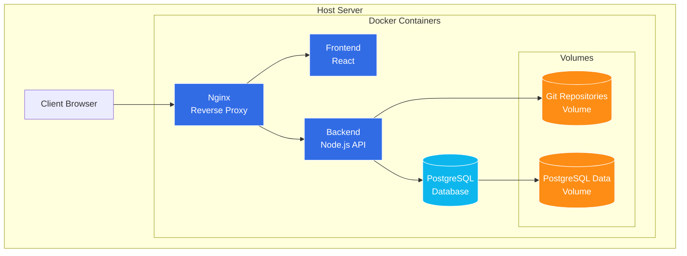

# GitGrub - Backlog Organization and Development Roadmap

## 1. Executive Summary

This document organizes the product backlog for GitGrub, a version-controlled recipe management application. It categorizes existing user stories, adds some foundational planning and DevOps work , and establishes a roadmap for MVP development.

## 2. Current State Assessment

GitGrub is currently in Proof of Concept (POC) stage with basic functionality for:

- Recipe creation, viewing, and editing
- Version history tracking
- Recipe forking
- Markdown-based recipe storage

The application uses a Git-based backend to handle versioning and forking, with Express.js serving as the API layer and React for the frontend.

## 3. Architectural Overview

The planned architecture for GitGrub is illustrated below:

This architecture focuses on a self-hosted solution rather than cloud deployment, using Docker containers to provide a consistent environment. The initial deployment will be on a local server.

## 4. Data Schema Evolution

Part of the development will be evolving the data structure from the current markdown-based storage to a more structured JSON format that will better support advanced features.

### Current Data Structure

- Recipes stored as markdown files in Git repositories
- Simple text-based format easy for initial development
- Limited structure for advanced features like ingredient scaling

### Target Data Structure for MVP

- JSON-based recipe format with structured fields
- PostgreSQL for user data and authentication
- Git repositories remain the source of truth for all recipe content
- Schema designed to support:
  - Precise ingredient quantity scaling
  - Unit conversion
  - Basic categorization and tagging

### Schema Requirements

- User schema in PostgreSQL (authentication, preferences, permissions)
- Recipe content as structured JSON in Git repositories (for versioning)
- No recipe metadata in PostgreSQL for MVP (will be added later as traffic grows)
- Git repositories will remain the source of truth for recipes

## 5. MVP Definition

The Minimum Viable Product (MVP) consists of the core functionality needed to provide value to users while validating the product concept. The MVP includes:

### Core Features

- Basic user authentication (signup, login, logout, password reset)
- Recipe creation, editing, and viewing with structured JSON format
- Recipe version history with ability to restore previous versions
- Recipe forking with attribution
- Recipe scaling for different serving sizes
- Basic ingredient structure with units and amounts
- Simple UI with recipe thumbnails and images
- Ability to favorite recipes
- Comments, ratings, and voting on recipes

### Technical Requirements

- Secure authentication and authorization with PostgreSQL for user data
- Reliable data persistence with Git-based versioning for all recipe content
- Responsive UI for desktop and mobile
- Containerized environments for consistent development and deployment
- Basic monitoring and backup strategy for self-hosted deployment
- Mobile-responsive UI

## 6. High Level Roadmap

### v0.1.0 - Technical Foundation

- [ ] Define database schema for users (PostgreSQL)
- [ ] Design JSON schema for recipe content
- [ ] Convert existing markdown recipes to JSON format
- [ ] Set up Docker development environment
- [ ] Implement Nginx reverse proxy configuration
- [ ] Create initial CI/CD pipeline
- [ ] Set up automated backups for Git repositories
- [ ] Set up OpenTofu for infrastructure management
- [ ] Define production environment structure for self-hosting with future cloud migration path
- [ ] Implement comprehensive test strategy including unit and integration tests
- [ ] Define schema validation mechanisms for recipe JSON structure
- [ ] Create standardized ingredient naming and categorization taxonomy
- [ ] Document security requirements for user authentication and data protection
- [ ] Implement internationalization foundation with language-specific JSON files and key-based text retrieval system to support future language additions

### **v0.2.0 - Core Recipe Management**

- [ ] Implement structured JSON format for recipes
- [ ] Enhance recipe versioning with Git backend
- [ ] Enhance recipe forking with attribution
- [ ] Add recipe scaling functionality
- [ ] Design and implement structured ingredient entry system with intuitive UI components for quantity, unit, and ingredient name fields
- [ ] Basic image support for recipes
- [ ] Develop ingredient data structure with separate fields for quantity, unit, and name to enable recipe scaling and unit conversion
- [ ] Build ingredient input with validation and consistent formatting
- [ ] Build recipe components based on wireframe:
  - [ ] Recipe header with title and rating
  - [ ] Ingredients section with quantity/unit/name structure
  - [ ] Step-by-step instructions with checkboxes
  - [ ] Create basic UI structure for recipe variation selector with horizontal scrolling capability
  - [ ] Recipe image gallery
  - [ ] Comments section
  - [ ] Recipe tagging system

### **v0.3.0 - User Authentication**

- [ ] Implement user registration and authentication
- [ ] Implement password reset flow and email verification
- [ ] Set up user profiles
- [ ] Implement security fundamentals (input validation, sanitization)
- [ ] Add proper authorization for recipe access
- [ ] Configure secure session management
- [ ] Documentation for user authentication flow

### **v0.4.0 - MVP Release**

- [ ] Rating system for recipes
- [ ] Create homepage featuring top-rated and recently updated recipes
- [ ] Basic monitoring for self-hosted deployment
- [ ] Bug fixes and performance optimization
- [ ] Complete test coverage for core functionality
- [ ] Initial set of 25 recipes across categories
- [ ] Enhance recipe variation selector with automatic ordering by rating and integrated visual rating indicators

### **v1.0.0 - Production Release**

- [ ] Full catalog of 100+ initial recipes
- [ ] Implement favorites system for users to bookmark recipes
- [ ] Recipe comments functionality
- [ ] Performance optimization for Git-based recipe access
- [ ] Enhanced error handling and logging
- [ ] Complete user documentation
- [ ] Production deployment guide for self-hosting

### **v1.1.0 - Enhanced User Experience**

- [ ] Enhanced image handling for recipes
- [ ] Improved UI/UX with better navigation
- [ ] Basic recipe search and filtering
- [ ] Recipe categorization and tagging system
- [ ] Unit conversion functionality
- [ ] Print-friendly recipe view
- [ ] Recipe sharing functionality
- [ ] Expand internationalization with multi-language UI, German and Spanish translations, and measurement system conversion for recipes

### **v1.2.0 - Community Features**

- [ ] Build comment system with upvoting/downvoting capability
- [ ] User activity feeds
- [ ] Favorite collections and organization
- [ ] User notifications for recipe updates and comments
- [ ] Enhanced user profiles
- [ ] Recipe recommendation engine (basic)
- [ ] Moderation tools for community content

### **v2.0.0 - Advanced Platform**

- [ ] Advanced recipe search capabilities
- [ ] Intelligent ingredient autocomplete
- [ ] Meal planning functionality
- [ ] Advanced analytics on recipe usage
- [ ] Enhanced internationalization support
- [ ] Integration with external recipe platforms
- [ ] Shopping list generation
- [ ] Mobile apps for iOS/Android

## 7. Technical Architecture Refinements

Based on the current POC, The following architectural refinements are recommended:

### Database & Storage

- Set up PostgreSQL for user data
- Define schema for structured recipe data in JSON format
- Update Git repository structure to accommodate JSON format

### Backend

- Enhance Node.js API to work with PostgreSQL for users and Git storage for recipes
- Add proper user authentication with OAuth
- Update recipe handling to support structured ingredients and scaling
- Add proper error handling and logging
- Implement input validation and sanitization

### Frontend

- Add state management solution (Redux, Context API)
- Create UI components for structured recipe entry
- Implement form validation
- Add responsive design for mobile
- Implement lazy loading for performance
- Add proper error handling and user feedback
- Develop with internationalization in mind

### DevOps

- Enhance Docker configuration for local development and production
- Set up basic monitoring for the local server
- Implement automated backups for Git repositories
- Configure Nginx reverse proxy for production

## 8. Risk Assessment

| Risk | Impact | Likelihood | Mitigation |
|------|--------|------------|------------|
| Self-hosted solution may face reliability or security challenges | High | Medium | Implement proper monitoring, backups, and security practices; document recovery procedures |
| Git-based storage may face performance issues as recipe collection grows | Medium | Medium | Implement caching strategies and optimize query patterns; plan for potential future database integration for recipe metadata |
| Authentication system complexity may delay development | Medium | Medium | Start with simple email/password, then add social logins incrementally |
| Free-time development may lead to inconsistent progress | Medium | High | Break work into small, self-contained tasks; establish clear documentation standards; hold regular check-ins |
| Initial content creation (100 recipes) may be resource-intensive | Medium | High | Begin collection early, consider outsourcing or using public domain recipes with attribution |
