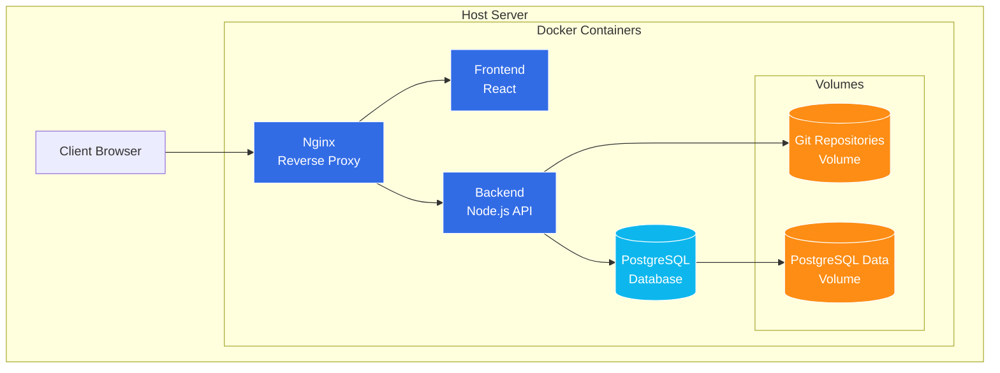

# GitGrub - Backlog Organization and Development Roadmap

## 1. Executive Summary

This document organizes the product backlog for GitGrub, a version-controlled recipe management application. It categorizes existing user stories, adds some foundational planning and DevOps work , and establishes a roadmap for MVP development.

## 2. Current State Assessment

GitGrub is currently in Proof of Concept (POC) stage with basic functionality for:

- Recipe creation, viewing, and editing
- Version history tracking
- Recipe forking
- Markdown-based recipe storage

The application uses a Git-based backend to handle versioning and forking, with Express.js serving as the API layer and React for the frontend.

## 3. Architectural Overview

The planned architecture for GitGrub is illustrated below:

This architecture focuses on a self-hosted solution rather than cloud deployment, using Docker containers to provide a consistent environment. The initial deployment will be on a local server.

## 4. Data Schema Evolution

Part of the development will be evolving the data structure from the current markdown-based storage to a more structured JSON format that will better support advanced features.

### Current Data Structure

- Recipes stored as markdown files in Git repositories
- Simple text-based format easy for initial development
- Limited structure for advanced features like ingredient scaling

### Target Data Structure for MVP

- JSON-based recipe format with structured fields
- PostgreSQL for user data and authentication
- Git repositories remain the source of truth for all recipe content
- Schema designed to support:
  - Precise ingredient quantity scaling
  - Unit conversion
  - Basic categorization and tagging

### Schema Requirements

- User schema in PostgreSQL (authentication, preferences, permissions)
- Recipe content as structured JSON in Git repositories (for versioning)
- No recipe metadata in PostgreSQL for MVP (will be added later as traffic grows)
- Git repositories will remain the source of truth for recipes

## 5. MVP Definition

The Minimum Viable Product (MVP) consists of the core functionality needed to provide value to users while validating the product concept. The MVP includes:

### Core Features

- Basic user authentication (signup, login, logout, password reset)
- Recipe creation, editing, and viewing with structured JSON format
- Recipe version history with ability to restore previous versions
- Recipe forking with attribution
- Recipe scaling for different serving sizes
- Basic ingredient structure with units and amounts
- Simple UI with recipe thumbnails and images
- Ability to favorite recipes
- Comments, ratings, and voting on recipes

### Technical Requirements

- Secure authentication and authorization with PostgreSQL for user data
- Reliable data persistence with Git-based versioning for all recipe content
- Responsive UI for desktop and mobile
- Containerized environments for consistent development and deployment
- Basic monitoring and backup strategy for self-hosted deployment

## 6. High Level Roadmap

### v0.1.0 - Technical Foundation

- Define database schema for users (PostgreSQL)
- Design JSON schema for recipe content
- Convert existing markdown recipes to JSON format
- Set up Docker development environment
- Implement Nginx reverse proxy configuration
- Create initial CI/CD pipeline
- Set up automated backups for Git repositories

### **v0.2.0 - Core Recipe Management**

- Implement structured JSON format for recipes
- Enhance recipe versioning with Git backend
- Enhance recipe forking with attribution
- Add recipe scaling functionality
- Create UI components for structured recipe entry
- Basic image support for recipes
- Input validation for recipe structure

### **v0.3.0 - User Authentication**

- Implement user registration and authentication
- Add password reset functionality
- Set up user profiles
- Implement security fundamentals (input validation, sanitization)
- Add proper authorization for recipe access
- Configure secure session management
- Documentation for user authentication flow

### **v0.4.0 - MVP Release**

- Ability to favorite recipes
- Basic recipe search and filtering
- Mobile-responsive UI
- Basic monitoring for self-hosted deployment
- Bug fixes and performance optimization
- Complete test coverage for core functionality
- Initial set of 25 recipes across categories

### **v1.0.0 - Production Release**

- Full catalog of 100+ initial recipes
- Recipe comments functionality
- Rating system for recipes
- Performance optimization for Git-based recipe access
- Enhanced error handling and logging
- Complete user documentation
- Production deployment guide for self-hosting

### **v1.1.0 - Enhanced User Experience**

- Enhanced image handling for recipes
- Improved UI/UX with better navigation
- Advanced recipe search capabilities
- Recipe categorization and tagging system
- Unit conversion functionality
- Print-friendly recipe view
- Recipe sharing functionality

### **v1.2.0 - Community Features**

- Comment voting system
- User activity feeds
- Favorite collections and organization
- User notifications for recipe updates and comments
- Enhanced user profiles
- Recipe recommendation engine (basic)
- Moderation tools for community content

### **v2.0.0 - Advanced Platform**

- Intelligent ingredient autocomplete
- Meal planning functionality
- Advanced analytics on recipe usage
- Enhanced internationalization support
- Integration with external recipe platforms
- Shopping list generation
- Mobile apps for iOS/Android

## 7. Backlog Organization by Epic

### 7.1 Foundation & Data Model

| ID | User Story | Priority | Status |
|----|------------|----------|--------|
| | As a developer, I need a well-defined database schema for users to support authentication and preferences. | Must Have | Not Started |
| | As a developer, I need a structured JSON schema for recipe content to support advanced features like ingrdient scaling. | Must Have | Not Started |
| | As a developer, I need unit and integration tests for the data model to ensure reliability. | Should Have | Not Started |
| | As a developer, I need a standardized ingredient naming and categorization system to support recipe search and filtering. | Should Have | Not Started |
| | As a developer, I need a schema validation mechanism to ensure recipe JSON structure remains consistent. | Nice to Have| Not Started |

### 7.2 User Authentication & Account Management

| ID | User Story | Priority | Status |
|----|------------|----------|--------|
| | As a user, I want streamlined authentication options, including one-time codes or social logins (Google/Facebook/Apple), to minimize friction during signup and login. | Nice to Have | Not Started |
| | As a registered user, I want to log in to my account so that I can access my saved recipes and preferences. | Must Have | Not Started |
| | As a user, I want to reset my password if I forget it so that I can regain access to my account. | Must Have | Not Started |
| | As a user, I want to log out of my account so that I can keep my information secure when using shared devices. | Must Have | Not Started |

### 7.3 Recipe Management

| ID | User Story | Priority | Status |
|----|------------|----------|--------|
| | As a home cook, I want to record my recipe in a structured format so that I can preserve it accurately for future use. | Must Have | Partially Implemented |
| | As a recipe creator, I want to update the ingredients or instructions of my existing recipes so that I can improve them over time. | Must Have | Partially Implemented |
| | As a recipe developer, I want to track the evolution of my recipe through multiple iterations so that I can see how it has changed over time. | Must Have | Partially Implemented |
| | As an innovative chef, I want to fork an existing recipe and modify it so that I can create my own version while maintaining attribution to the original. | Must Have | Partially Implemented |

### 7.4 Recipe Utility Features

| ID | User Story | Priority | Status |
|----|------------|----------|--------|
| | As a host, I want to easily scale a recipe for different party sizes so that I can prepare the right amount of food without recalculating manually. | Must Have | Not Started |
| | As a recipe creator, I want an intelligent autocomplete feature when entering ingredients so that I can save time, maintain consistent naming conventions, and improve searchability across the platform. | Nice to Have | Not Started |
| | As a recipe creator, I want an intuitive workflow for adding amounts and units to ingredients so that my recipes can be precisely scaled by users.| Should have | Not Started |

### 7.5 Community & Social Features

| ID | User Story | Priority | Status |
|----|------------|----------|--------|
| | As a user browsing recipes, I want to "favorite" recipes I'm interested in so that I can quickly find and access them later without having to search again. | Must Have | Not Started |
| | As a community member, I want to comment on a recipe so that I can share my experience, offer modifications, and collaborate. | Must Have | Not Started |
| | As a community member, I want to upvote or downvote comments so that the most helpful feedback rises to the top and improves everyone's cooking experience. | Must Have | Not Started |
| | As a community member, I want to rate recipes I've tried so that I can provide feedback and help others find quality content. | Must Have | Not Started |
| | As a user, I want a homepage that displays top-rated and recently updated recipes so I can discover popular content without searching. | Must Have | Not Started |

### 7.6 User Interface & Experience

| ID | User Story | Priority | Status |
|----|------------|----------|--------|
| | As a user browsing recipes, I want to see high-quality thumbnails and photos of dishes so that I can visually assess recipes and make quicker, more confident decisions about what to cook. | Must Have | Not Started |
| | As a user browsing recipes, I want access to a diverse catalog of at least 100 initial recipes across multiple categories to make the platform immediately useful and engaging. | Must Have | Not Started |

### 7.7 DevOps & Infrastructure1

| ID | User Story | Priority | Status |
|----|------------|----------|--------|
| | As a developer, I need a local development environment with Docker to ensure consistency across team members. | Must Have | Partially Implemented |
| | As a developer, I need a deployment process for the local server to easily update the application. | Must Have | Not Started |
| | As a system administrator, I need a backup strategy for Git repositories to prevent data loss. | Must Have | Not Started |
| | As a system administrator, I need basic monitoring for the self-hosted server to ensure reliability. | Should Have | Not Started |
| | As a developer, I need integration tests that can be run locally to maintain code quality. | Should Have | Not Started |
| | As a developer, I need to configure Nginx as a reverse proxy to properly route traffic between frontend, backend, and static assets. | Must Have | Not Started |
| | As a developer, I need updated Dockerfiles and docker-compose configurations for production deployment. | Must Have | Not Started |
| | As a system administrator, I need documented procedures for server setup and maintenance. | Should Have | Not Started |

### 7.8 Security

| ID | User Story | Priority | Status |
|----|------------|----------|--------|
| | As a user, I want my account and personal recipes to be secure from unauthorized access. | Must Have | Not Started |
| | As a system administrator, I need proper input validation and sanitization to prevent injection attacks. | Must Have | Not Started |
| | As a system administrator, I need proper authentication and authorization mechanisms to protect user data. | Must Have | Not Started |

## 8. Technical Architecture Refinements

Based on the current POC, The following architectural refinements are recommended:

### Database & Storage

- Set up PostgreSQL for user data only
- Define schema for structured recipe data in JSON format
- Update Git repository structure to accommodate JSON format

### Backend

- Enhance Node.js API to work with PostgreSQL for users and Git storage for recipes
- Add proper user authentication with OAuth
- Update recipe handling to support structured ingredients and scaling
- Add proper error handling and logging
- Implement input validation and sanitization

### Frontend

- Add state management solution (Redux, Context API)
- Create UI components for structured recipe entry
- Implement form validation
- Add responsive design for mobile
- Implement lazy loading for performance
- Add proper error handling and user feedback
- Develop with internationalization in mind

### DevOps

- Enhance Docker configuration for local development and production
- Set up basic monitoring for the local server
- Implement automated backups for Git repositories
- Configure Nginx reverse proxy for production

## 9. Risk Assessment

| Risk | Impact | Likelihood | Mitigation |
|------|--------|------------|------------|
| Self-hosted solution may face reliability or security challenges | High | Medium | Implement proper monitoring, backups, and security practices; document recovery procedures |
| Git-based storage may face performance issues as recipe collection grows | Medium | Medium | Implement caching strategies and optimize query patterns; plan for potential future database integration for recipe metadata |
| Authentication system complexity may delay development | Medium | Medium | Start with simple email/password, then add social logins incrementally |
| Free-time development may lead to inconsistent progress | Medium | High | Break work into small, self-contained tasks; establish clear documentation standards; hold regular check-ins |
| Initial content creation (100 recipes) may be resource-intensive | Medium | High | Begin collection early, consider outsourcing or using public domain recipes with attribution |

## 10. Next Steps

1. Finalize user schema design for PostgreSQL
2. Design JSON structure for recipe content
3. Develop prototype for converting markdown recipes to JSON format
4. Enhance Docker configuration for development environment
5. Begin implementing user authentication with PostgreSQL
