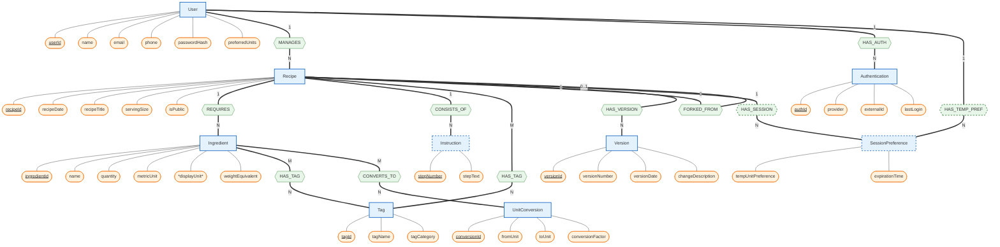

```mermaid
graph TD
    %% Core Entities - Rectangles
    User["User"]
    Recipe["Recipe"]
    Ingredient["Ingredient"]
    Instruction["Instruction"]
    Tag["Tag"]
    Version["Version"]
    Authentication["Authentication"]
    UnitConversion["UnitConversion"]
    SessionPreference["SessionPreference"]
    
    %% Attributes - Ovals
    %% User attributes
    User --- userId(["userId"])
    User --- userName(["name"])
    User --- userEmail(["email"])
    User --- userPhone(["phone"])
    User --- passwordHash(["passwordHash"])
    User --- preferredUnits(["preferredUnits"])
    
    %% Recipe attributes
    Recipe --- recipeId(["recipeId"])
    Recipe --- recipeDate(["recipeDate"])
    Recipe --- recipeTitle(["recipeTitle"]) 
    Recipe --- servingSize(["servingSize"])
    Recipe --- isPublic(["isPublic"])
    
    %% Ingredient attributes
    Ingredient --- ingredientId(["ingredientId"])
    Ingredient --- ingredientName(["name"])
    Ingredient --- quantity(["quantity"])
    Ingredient --- metricUnit(["metricUnit"])
    Ingredient --- displayUnit(["*displayUnit*"])
    Ingredient --- weightEquivalent(["weightEquivalent"])
    
    %% Instruction attributes
    Instruction --- stepNumber(["stepNumber"])
    Instruction --- stepText(["stepText"])
    
    %% Tag attributes
    Tag --- tagId(["tagId"])
    Tag --- tagName(["tagName"])
    Tag --- tagCategory(["tagCategory"])
    
    %% Version attributes
    Version --- versionId(["versionId"])
    Version --- versionNumber(["versionNumber"])
    Version --- versionDate(["versionDate"])
    Version --- changeDescription(["changeDescription"])
    
    %% Authentication attributes
    Authentication --- authId(["authId"])
    Authentication --- provider(["provider"])
    Authentication --- externalId(["externalId"])
    Authentication --- lastLogin(["lastLogin"])
    
    %% UnitConversion attributes
    UnitConversion --- conversionId(["conversionId"])
    UnitConversion --- fromUnit(["fromUnit"])
    UnitConversion --- toUnit(["toUnit"])
    UnitConversion --- conversionFactor(["conversionFactor"])
    
    %% SessionPreference attributes
    SessionPreference --- tempUnitPreference(["tempUnitPreference"])
    SessionPreference --- expirationTime(["expirationTime"])

    
    %% Relationships - Diamonds with cardinality
    User === |"1"| MANAGES{{"MANAGES"}} === |"N"| Recipe
    Recipe === |"1"| REQUIRES{{"REQUIRES"}} === |"N"| Ingredient
    Recipe === |"1"| CONSISTS_OF{{"CONSISTS_OF"}} === |"N"| Instruction
    Recipe === |"M"| HAS_TAG{{"HAS_TAG"}} === |"N"| Tag
    Ingredient === |"M"| HAS_TAG2{{"HAS_TAG"}} === |"N"| Tag
    Recipe === |"0"| FORKED_FROM{{"FORKED_FROM"}} === |"0..1"| Recipe
    Recipe === |"1"| HAS_VERSION{{"HAS_VERSION"}} === |"N"| Version
    User === |"1"| HAS_AUTH{{"HAS_AUTH"}} === |"N"| Authentication
    Ingredient === |"M"| CONVERTS_TO{{"CONVERTS_TO"}} === |"N"| UnitConversion
    User === |"1"| HAS_TEMP_PREF{{"HAS_TEMP_PREF"}} === |"N"| SessionPreference
    Recipe === |"1"| HAS_SESSION{{"HAS_SESSION"}} === |"N"| SessionPreference
    
    %% Styling
    classDef entity fill:#E3F2FD,stroke:#1565C0,stroke-width:2px
    classDef weakEntity fill:#E3F2FD,stroke:#1565C0,stroke-width:2px,stroke-dasharray:5
    classDef attribute fill:#FFF3E0,stroke:#EF6C00,stroke-width:1px
    classDef keyAttribute fill:#FFF3E0,stroke:#EF6C00,stroke-width:1px,text-decoration:underline
    classDef relationship fill:#E8F5E9,stroke:#2E7D32
    classDef identifyingRelationship fill:#E8F5E9,stroke:#2E7D32,stroke-width:2px,stroke-dasharray:5
    
    class User,Recipe,Ingredient,Tag,Version,Authentication,UnitConversion entity
    class Instruction,SessionPreference weakEntity
    class recipeDate,userName,userEmail,userPhone,quantity,recipeTitle,stepText,tagName,tagCategory,ingredientName,unit,weightEquivalent,servingSize,isPublic,preferredUnits,passwordHash,versionNumber,versionDate,changeDescription,provider,externalId,lastLogin,fromUnit,toUnit,conversionFactor,tempUnitPreference,expirationTime,metricUnit,displayUnit attribute
    class recipeId,ingredientId,userId,tagId,stepNumber,versionId,authId,conversionId keyAttribute
    class MANAGES,REQUIRES,CONSISTS_OF,HAS_TAG,HAS_TAG2,FORKED_FROM,HAS_VERSION,HAS_AUTH,CONVERTS_TO relationship
    class ,HAS_TEMP_PREF,HAS_SESSION identifyingRelationship
```