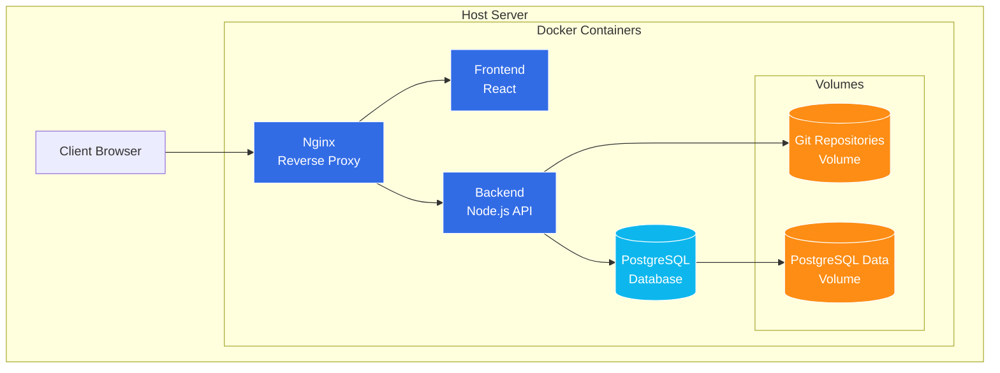

```mermaid
flowchart TB
    subgraph "Host Server"
        subgraph "Docker Containers"
            nginx[Nginx <br>Reverse Proxy]
            backend[Backend<br>Node.js API]
            frontend[Frontend<br>React]
            postgres[(PostgreSQL<br>Database)]
            
            subgraph "Volumes"
                git_repos[(Git Repositories<br>Volume)]
                pg_data[(PostgreSQL Data<br>Volume)]
            end
        end
        
        %% External connections
        user[Client Browser] --> nginx
        
        %% Internal connections
        nginx --> frontend
        nginx --> backend
        backend --> postgres
        backend --> git_repos
        postgres --> pg_data
    end
    
    classDef container fill:#326ce5,stroke:#fff,stroke-width:1px,color:white;
    classDef volume fill:#fd8d14,stroke:#fff,stroke-width:1px,color:white;
    classDef db fill:#0db7ed,stroke:#fff,stroke-width:1px,color:white;
    classDef schema fill:#f8f9fa,stroke:#d0d7de,stroke-width:1px,color:black;
    
    class nginx,backend,frontend container;
    class git_repos,pg_data volume;
    class postgres db;
    class users,recipes,versions,forks schema;
```